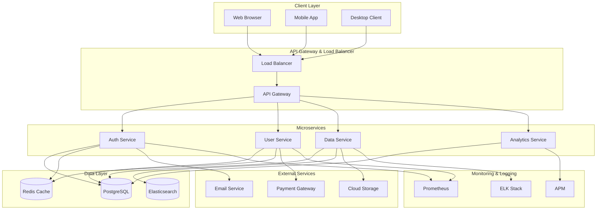

# Architecture Overview

## System Architecture Diagram

## Architecture Components

### Client Layer
- **Web Browser**: Main web application for desktop users
- **Mobile App**: Native mobile applications for iOS and Android
- **Desktop Client**: Cross-platform desktop application

### API Gateway & Load Balancing
- **Load Balancer**: Distributes incoming traffic across multiple API gateway instances
- **API Gateway**: Central entry point for all client requests with routing, rate limiting, and authentication

### Microservices
- **Auth Service**: Handles user authentication and authorization
- **User Service**: Manages user profiles and preferences
- **Data Service**: Processes and stores business data
- **Analytics Service**: Tracks and analyzes user behavior and system metrics

### Data Layer
- **PostgreSQL**: Primary relational database for persistent data storage
- **Redis Cache**: In-memory cache for high-speed data access
- **Elasticsearch**: Full-text search and analytics database

### External Services
- **Email Service**: Sends transactional and marketing emails
- **Payment Gateway**: Processes payments and manages transactions
- **Cloud Storage**: Stores files and media assets

### Monitoring & Logging
- **Prometheus**: Metrics collection and monitoring
- **ELK Stack**: Elasticsearch, Logstash, Kibana for log aggregation and analysis
- **APM**: Application Performance Monitoring for distributed tracing

## Data Flow

1. Clients send requests to the Load Balancer
2. Load Balancer routes to API Gateway
3. API Gateway routes requests to appropriate microservices
4. Microservices interact with data stores and external services
5. Monitoring systems collect metrics and logs from all components
6. Results are returned through the API Gateway back to clients
